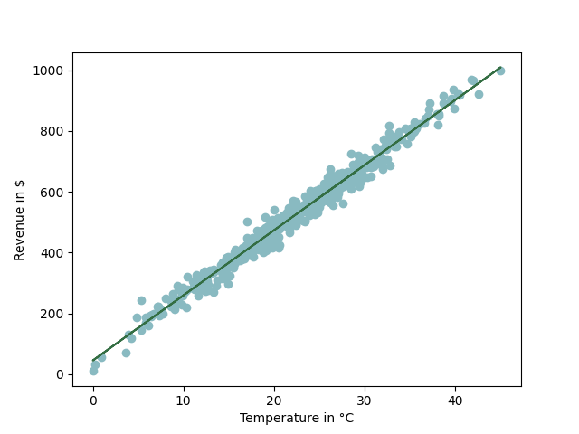
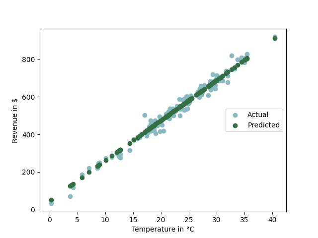

# Ice Cream Sales Analysis 

A machine learning project that analyzes the relationship between temperature and ice cream sales revenue using linear regression.

## About

This project demonstrates how temperature affects ice cream sales revenue through data analysis and visualization. Using a dataset from Kaggle, we explore the correlation between daily temperature and ice cream sales, then build a predictive model using linear regression to forecast sales based on temperature.

## Objectives

- Analyze the correlation between temperature and ice cream sales
- Visualize the relationship using scatter plots and regression lines
- Build a linear regression model to predict sales revenue
- Evaluate model performance and make predictions

## Dataset

The project uses the dataset from https://www.kaggle.com/datasets/vinicius150987/ice-cream-revenue. It contains:
- **Temperature**: Daily temperature in Celsius (°C)
- **Revenue**: Ice cream sales revenue in dollars ($)
- **Size**: 500+ data points

## Technologies Used

- **Python 3.x**
- **pandas** - Data manipulation and analysis
- **matplotlib** - Data visualization and plotting
- **scikit-learn** - Machine learning library for linear regression
- **scipy** - Statistical functions
- **numpy** - Numerical computing


### Prerequisites

Make sure you have Python 3.x installed and the following packages:

```bash
pip install pandas matplotlib scikit-learn scipy numpy
```

### Installation

1. **Clone the repository**
   ```bash
   git clone https://github.com/Theerttha/Ice_Cream.git
   cd Ice_Cream
   ```

2. **Ensure you have the dataset**
   Make sure `IceCreamData.csv` is in the project directory

3. **Run the analysis**
   ```bash
   python main.py
   ```

## Project Structure

```
Ice_Cream/
├── main.py                 # Main analysis script
├── IceCreamData.csv        # Dataset file
└── README.md              # Project documentation
```

## Features & Functionality

### Data Processing
- **CSV Loading**: Reads ice cream sales data from CSV file
- **Data Reshaping**: Prepares data for machine learning algorithms
- **Train-Test Split**: Divides data into training (75%) and testing (25%) sets

### Visualization
- **Scatter Plot**: Shows relationship between temperature and revenue
- **Regression Line**: Displays the linear trend line
- **Prediction Comparison**: Visualizes actual vs predicted values
- **Custom Styling**: Uses appealing color scheme (#89BAC1 for data, #346E43 for predictions)

### Machine Learning
- **Linear Regression**: Implements sklearn's LinearRegression model
- **Model Training**: Trains on 75% of the data
- **Performance Evaluation**: Calculates R² score to measure model accuracy
- **Predictions**: Makes revenue predictions based on temperature

### Statistical Analysis
- **Correlation Analysis**: Uses scipy.stats.linregress for statistical insights
- **Model Scoring**: Evaluates prediction accuracy

## Key Insights

The analysis reveals:
- Strong positive correlation between temperature and ice cream sales
- Higher temperatures consistently lead to increased revenue
- Linear regression provides a reliable model for sales prediction
- The relationship follows a predictable pattern suitable for business forecasting

## Visualizations

The project generates two main plots:

1. **Temperature vs Revenue Scatter Plot**
   - Shows all data points with regression line
   - Demonstrates the linear relationship

2. **Actual vs Predicted Revenue**
   - Compares model predictions with actual values
   - Helps evaluate model performance visually

## Code Structure

### Main Functions:

- `open_file()`: Loads and preprocesses the CSV data
- `plot(x,y)`: Creates scatter plot with regression line
- `linear_regression(X,Y)`: Trains the ML model and makes predictions
- `plot_prediction(x,y,prediction)`: Visualizes actual vs predicted values

## Model Performance

The linear regression model provides:
- R² score indicating goodness of fit
- Visual comparison of predictions vs actual values
- Statistical significance through scipy analysis


## Learning Outcomes

This project demonstrates:
- Data analysis workflow from loading to visualization
- Machine learning pipeline implementation
- Statistical analysis and interpretation
- Python libraries integration for data science
- Business insights extraction from data

# Images


